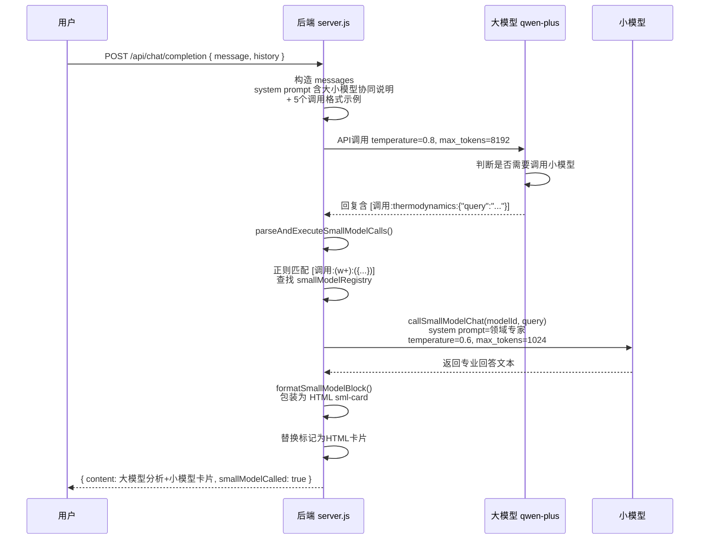

```mermaid
sequenceDiagram
    participant User as 用户
    participant Backend as 后端 server.js
    participant LLM as 大模型 qwen-plus
    participant Small as 小模型

    User->>Backend: POST /api/chat/completion { message, history }

    Backend->>Backend: 构造 messages<br/>system prompt 含大小模型协同说明<br/>+ 5个调用格式示例

    Backend->>LLM: API调用 temperature=0.8, max_tokens=8192

    LLM->>LLM: 判断是否需要调用小模型
    LLM-->>Backend: 回复含 [调用:thermodynamics:{"query":"..."}]

    Backend->>Backend: parseAndExecuteSmallModelCalls()
    Backend->>Backend: 正则匹配 [调用:(w+):({...})]<br/>查找 smallModelRegistry

    Backend->>Small: callSmallModelChat(modelId, query)<br/>system prompt=领域专家<br/>temperature=0.6, max_tokens=1024

    Small-->>Backend: 返回专业回答文本

    Backend->>Backend: formatSmallModelBlock()<br/>包装为 HTML sml-card

    Backend->>Backend: 替换标记为HTML卡片

    Backend-->>User: { content: 大模型分析+小模型卡片, smallModelCalled: true }
```
